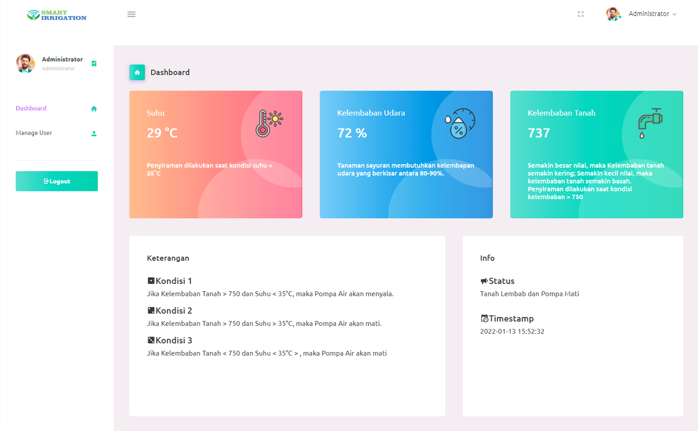

  
   
  

## Tentang aplikasi ini

Tanaman yang berkualitas dihasilkan dengan memperhatikan kelembaban tanah dan suhu tanaman. Kelembaban dan suhu tanaman dipengaruhi oleh sistem irigasi tanaman dengan sebuah plant sprinkler yang dapat mengontrol debit air sesuai dengan kebutuhan tanaman. Menggunakan Soilmoisture Sensor yang berfungsi sebagai pembaca kelembaban tanah tanaman dan DHT11 sebagai pembaca suhu udara di sekitar tanaman. Kemudian modul relay berfungsi wuntuk mengaktifkan dan menonaktifkan pompa air. Aplikasi ini digunakan untuk menampilkan hasil data dan Modul ESP8266 juga digunakan sebagai tampilan hasil data sensor yang akan dikirimkan pada halaman ini.

- [Bootstrap v5.0](https://getbootstrap.com/).
- [Font-Awesome v4.7](https://fontawesome.com/v4.7/).
- [JQuery 3.6.0](https://jquery.com/).
- [Chart.js 3.3.2](https://www.chartjs.org/).
- [Fonts Google](https://fonts.google.com/).

## Info

Web desain ini masih butuh untuk dikembangkan kembali. Anda dapat berkontribusi untuk pengembangan web desain ini dengan melakukan pull-requests atau clone. Pastikan anda menggunakannya dengan baik dan bijak.
